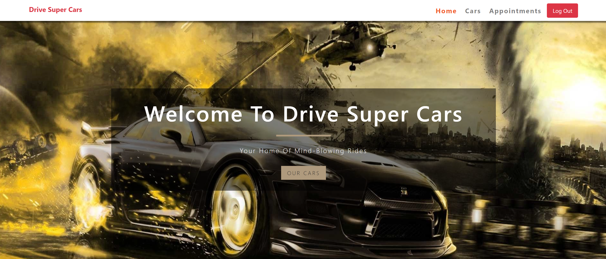
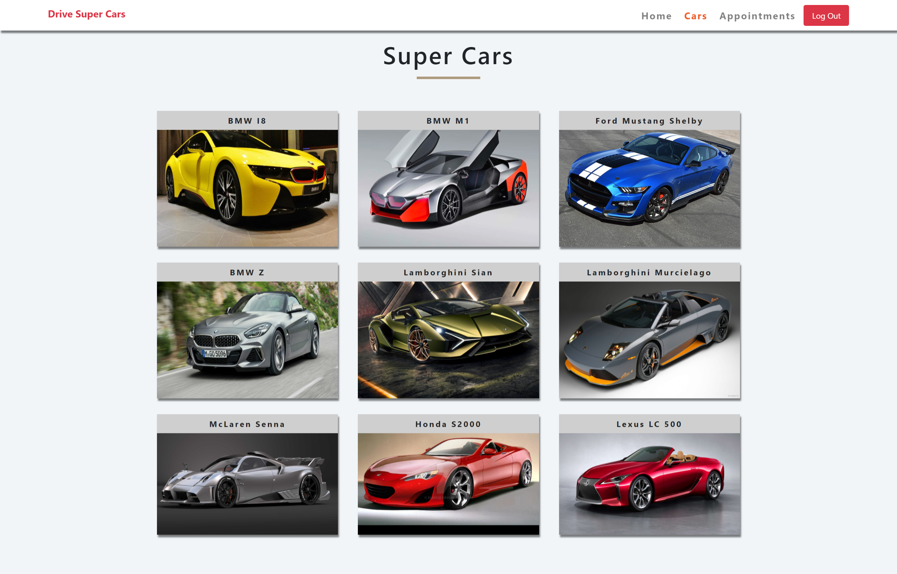
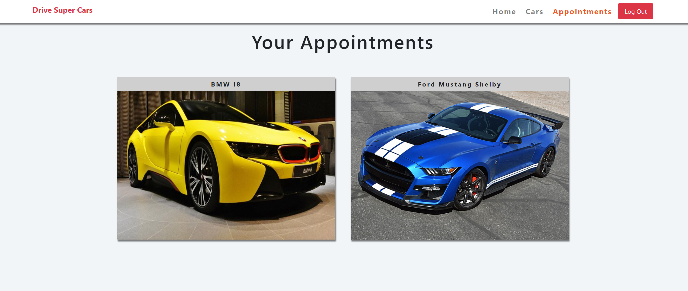

# Drive Super Cars

A tablet web app for booking appointments to test drive super cars.

**Home Page**

  

**Cars Page**

  

**Appointments Page**

  

## About this project
This Application is built as a front end app consuming a Ruby on Rails [API](https://drive-super-cars.herokuapp.com) separately deployed to Heroku. It uses Auth0 for Authentication and Authorization

## End Points
This application consumes a couple of endpoints served by the [API](https://drive-super-cars.herokuapp.com) accessible online as the base Url;

## POST
- /users - (create user account)
- /appointments - (create appointment)

## GET
- /cars - (fetch all cars)
- /cars/:id - (fetch single car)
- /users/:id - (fetch user appointments)

## Built With
- AuthO
- ReactJs
- Redux
- Netlify (For deployment)
- Jest
- CSS (Modules)
- HTML
- Webpack
- ES6 JavaScript.

## Live Demo
For the full working application click [here](https://drive-super-cars.netlify.app)

### Production Dependencies

| **Dependency**   | **Use**                                               |
| ---------------- | ----------------------------------------------------- |
| prop-types       | Declare types for props passed into React components  |
| react            | React library                                         |
| react-toastify   | Display messages to the user                          |
| react-dom        | React library for DOM rendering                       |
| react-redux      | Connects React components to Redux                    |
| react-router-dom | React library for routing                             |
| redux            | Library for unidirectional data flows                 |
| redux-thunk      | Async redux library                                   |
| auth0-js         | Auth0 Authentication                                  |

### Development Dependencies

| **Dependency**                  | **Use**                                                          |
| ------------------------------- | ---------------------------------------------------------------- |
| babel-eslint                    | Lint modern JavaScript via ESLint                                |
| eslint                          | Lints JavaScript                                                 |
| eslint-plugin-react-hooks       | Adds additional React-hooks-related rules to ESLint              |
| eslint-plugin-import            | Advanced linting of ES6 imports                                  |
| eslint-plugin-react             | Adds additional React-related rules to ESLint                    |
| fetch-mock                      | Mock fetch calls                                                 |
| jest                            | Automated testing framework                                      |
| node-fetch                      | Make HTTP calls via fetch using Node - Used by fetch-mock        |
| react-test-renderer             | Render React components for testing                              |
| @testing-library                | Test React components                                            |
| redux-immutable-state-invariant | Warn when Redux state is mutated                                 |
| redux-mock-store                | Mock Redux store for testing                                     |
| stylelint                       | Lints Css                                                        |
| stylelint-config-standard       | Advanced linting configoration for css                           |
| stylelint-csstree-validator     | Advanced linting validation for css                              |
| stylelint-scss                  | Adds additional SCSS-related rules to StyleLint                  |

## Installation
To get a local copy up and running follow these simple example steps.

### Setup

Clone [this](https://github.com/somoye123/Drive-Super-Cars-Frontend.git) repository

### Follow:
1. cd into the project directory
2. run yarn install
3. run yarn start
4. Navigate to localhost:3000

## Author

👤 **Somoye Ayotunde**

- Github: [@somoye123](https://github.com/somoye123)
- Twitter: [@ayotunde_197](https://twitter.com/ayotunde_197)
- LinkedIn: [somoye-ayotunde](https://www.linkedin.com/in/somoye-ayotunde)
- Mail: [somoye.ayotunde@gmail.com](somoye.ayotunde@gmail.com)

## 🤝 Contributing

Contributions, issues and feature requests are welcome!

Feel free to check the [issues page](https://github.com/somoye123/Drive-Super-Cars-Frontend/issues).

## Show your support

Give a ⭐️ if you like this project!

## Acknowledgments
  - Microverse
  - You can access all the design info (color, typography, layouts) in this link:
  - [Design](https://www.behance.net/gallery/26425031/Vespa-Responsive-Redesign)
  - Design idea by [ Murat Korkmaz on Behance](https://www.behance.net/muratk)
